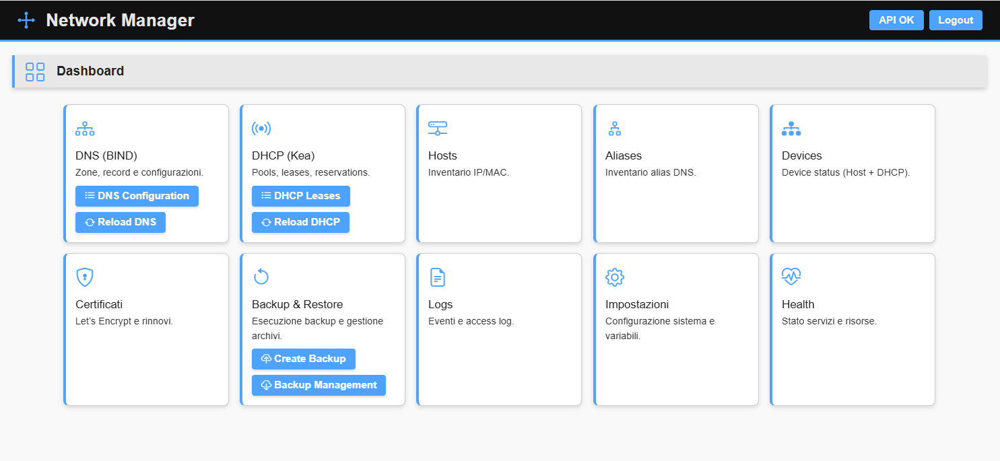

# 🌐 Network Manager

A **unified web application for complete control of your network infrastructure**, designed as an integrated frontend for **BIND** (DNS), **Kea DHCP**, and **Let's Encrypt** certificate management.

[![Latest Release][releases-img]][releases-url]
[![GHCR Image][ghcr-image-img]][ghcr-image-url]
[![Last Commit][last-commit-img]][last-commit-url]
[![Check Status][check-status-img]][check-status-url]
[![Docker Publish][docker-publish-img]][docker-publish-url]
[![License Status][license-img]][license-url]
[![BuyMeCoffee][buymecoffee-img]][buymecoffee-url]



Network Manager is a self-hosted web application that provides a centralized interface for managing DNS, DHCP, and TLS certificate services.

Built for BIND, Kea DHCP, and Let's Encrypt, it enables administrators to manage hosts, aliases, DNS records, DHCP reservations, certificates, backups, and system settings from a single dashboard, eliminating the need to manually edit configuration files.

By centralizing network service management, Network Manager reduces configuration errors, improves operational efficiency, and simplifies day-to-day administration of network infrastructure.

Designed to run easily via **Docker** and **Docker Compose**, with configuration via environment variables.

---

## ❓ Why Network Manager?

Managing DNS, DHCP and certificates often requires editing multiple configuration files across different services.

Network Manager provides a single interface to:

- Manage hosts and network devices
- Generate DNS and DHCP configurations
- Monitor leases and system health
- Manage TLS certificates
- Backup and restore configurations

All from one centralized dashboard.

---

## ✨ Features
### 🌐 DNS Management
- DNS hosts and aliases
- Forward and reverse records
- Automatic BIND configuration generation
 
### 📡 DHCP Management
- DHCP reservations
- Lease monitoring
- IPv4 and IPv6 support
 
### 🖥️ Device Inventory
- Host inventory management
- Device status monitoring
- Integrated network overview
 
### 🔒 Certificate Management
- Let's Encrypt integration
- Certificate monitoring
- Renewal management

### 💾 Backup & Recovery
- Backup and restore
- Integrity verification
- Configuration protection

### ⚙️ Operations
- DNS and DHCP service reload
- Automatic configuration deployment
- Centralized service administration
 
### 🐳 Deployment
- Docker-native
- Lightweight SQLite storage
- Single-container deployment

---

## 🏛️ Architecture
```text
                 ┌─────────────────┐
                 │  Web Interface  │
                 └────────┬────────┘
                          │
                          ▼
                 ┌─────────────────┐
                 │ Network Manager │
                 └─────────────────┘
                          │
         ┌────────────────┼────────────────┐
         ▼                ▼                ▼
     BIND DNS         Kea DHCP      Let's Encrypt
```

---

## 🚀 Quick start

Create a persistent volume:
 
```bash
mkdir data
```
 
Run the container:
 
```bash
docker run -d \
       --name network-manager \
       -p 8000:8000 \
       -v $(pwd)/data:/data \
       ghcr.io/xraver/network-manager:latest
```
 
Open your browser and navigate to:

```text
http://localhost:8000
```
For Docker Compose examples and production deployments, see the Wiki.

---

## 📖 Documentation
Complete documentation is available in the Wiki:
- Getting Started
- Installation
- Configuration
- DNS Management
- DHCP Management
- Certificate Management
- Security
- Backup & Restore
- Troubleshooting
- Development Guide

---

## 🔒 Security
Network Manager includes:
- Session-based authentication
- Login rate limiting
- Security headers
- CSP protection
- Trusted Host validation
- HTTPS-aware cookies
- Docker Secrets support

For production hardening recommendations, see the Security section in the Wiki.

---

## 🚧 Project Status
Network Manager is actively developed and currently considered beta software.

While the core functionality is already available, features, APIs, and user interfaces may evolve before the first stable release.

The roadmap is available in [TODO.md](TODO.md).

---

## 🤝 Contributing
Contributions, bug reports and feature requests are welcome.
1. Fork the repository
2. Create a feature branch
3. Commit your changes
4. Submit a Pull Request

---

## 📄 License
[MIT](http://opensource.org/licenses/MIT) – see the [LICENSE](LICENSE) file for details © Giorgio Ravera

---

## ☕ Support the Project
Network Manager is an open-source project developed and maintained in my spare time.

If you enjoy using it and would like to show your appreciation, consider supporting the project.

[![BuyMeCoffee][buymecoffee-button]][buymecoffee-url]

---

[license-img]: https://img.shields.io/github/license/xraver/network-manager?logo=open-source-initiative
[license-url]: LICENSE
[releases-img]: https://img.shields.io/github/v/tag/xraver/network-manager?label=release&logo=github
[releases-url]: https://github.com/xraver/network-manager/releases
[docker-publish-img]: https://github.com/xraver/network-manager/actions/workflows/docker-publish.yaml/badge.svg
[docker-publish-url]: https://github.com/xraver/network-manager/actions/workflows/docker-publish.yaml
[ghcr-image-img]: https://img.shields.io/badge/GHCR-image-blue?logo=docker
[ghcr-image-url]: https://github.com/xraver/network-manager/pkgs/container/network-manager
[image-security-img]: https://img.shields.io/badge/SBOM%20%2F%20Provenance-enabled-brightgreen?logo=security
[image-security-url]: https://github.com/xraver/network-manager
[last-commit-img]: https://img.shields.io/github/last-commit/xraver/network-manager
[last-commit-url]: https://github.com/xraver/network-manager/commits/main
[check-status-img]: https://github.com/xraver/network-manager/actions/workflows/ci.yaml/badge.svg
[check-status-url]: https://github.com/xraver/network-manager/actions/workflows/ci.yaml
[buymecoffee-img]: https://img.shields.io/badge/buy%20me%20a%20coffee-donate-yellow.svg
[buymecoffee-button]: https://www.buymeacoffee.com/assets/img/guidelines/download-assets-sm-2.svg
[buymecoffee-url]: https://www.buymeacoffee.com/raverag
